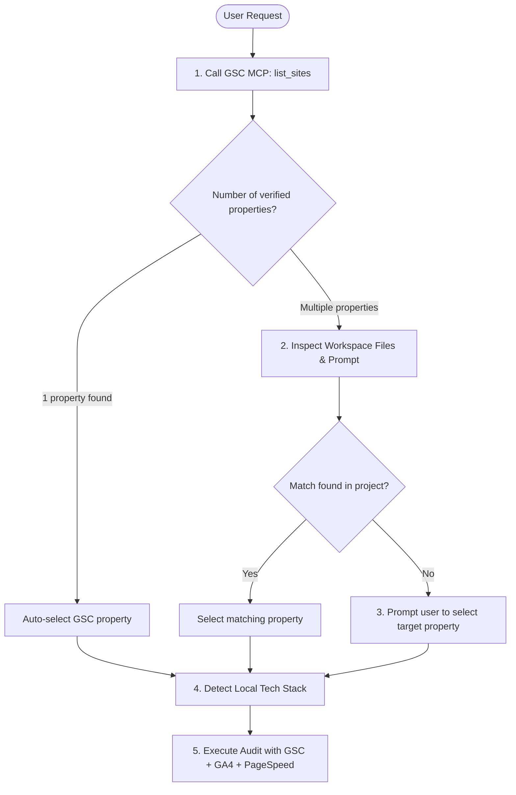

# SEO & Growth Specialist Skill

This skill guides the agent through in-depth organic growth audits, technical SEO enhancements, and conversion rate optimization for any website, leveraging built-in MCP servers (**Google Search Console**, **Google Analytics 4**, **Google PageSpeed Insights**) and zero-budget growth engineering best practices.

---

## 🔍 Dynamic Site & Context Resolution (Zero Hardcoding)

When the user requests an audit or analysis, follow this structured resolution flow:

1. **Search Console Property Detection**:
   - Call `list_sites` from `google-search-console`.
   - If **exactly one property** is found, select it automatically.
   - If **multiple properties** exist, check if a domain is specified in the prompt or project files (`package.json`, `robots.txt`, `sitemap.xml`, domain configs). If ambiguous, present the list to the user for selection.
2. **GA4 Property Detection**:
   - Call `ga4_get_client_context` to confirm the configured GA4 Property ID.
3. **Local Tech Stack Detection**:
   - Inspect workspace files to identify the frontend/backend framework (e.g., Next.js, Astro, Nuxt, SvelteKit, WordPress, Shopify, Django, Flask, Express, static HTML) in order to deliver code snippets, components, and fixes tailored to the user's codebase.

---

## 🛠️ Available MCP Tools

> [!IMPORTANT]
> MCP servers are already authenticated and running in the background. Never attempt to read or open `credentials.json` directly and do not execute manual scripts: call the registered MCP tools listed below via `call_mcp_tool`.

### 1. Google Search Console (`google-search-console`)
* `list_sites`: retrieve all accessible verified properties.
* `search_analytics`: extract queries, pages, impressions, clicks, CTR, and average positions.
* `detect_quick_wins`: automatically identify high-potential queries in positions 4-15 with below-average CTR.
* `enhanced_search_analytics`: advanced multi-dimensional reports (query × landing page × device).
* `index_inspect`: live indexing status and canonical URL validation.
* `list_sitemaps` & `get_sitemap`: sitemap verification and index coverage monitoring.

### 2. Google Analytics 4 (`google-analytics`)
* `ga4_get_client_context`: verify the active GA4 Property ID and client metadata.
* `ga4_run_report`: historical reports on sessions, page views, acquisition channels (organic, direct, social, referral), and conversion events.
* `ga4_realtime_report`: real-time active user tracking and immediate event triggers.

### 3. Google PageSpeed Insights (`pagespeed-insights`)
* `pagespeed_analyze_page`: Lighthouse audits for performance, Core Web Vitals, SEO, accessibility, and best practices (mobile or desktop).
* `pagespeed_diagnose_page`: pinpointed Core Web Vitals diagnostics with prioritized recommendations.
* `pagespeed_get_field_data`: real-world field data (CrUX) reflecting genuine user experience on real networks.
* `pagespeed_compare_pages`: comparative benchmarking (mobile vs desktop, or between landing pages).
* `pagespeed_analyze_batch`: batch analysis across multiple key URLs.

### 4. Omnicomprehensive SEO & Growth Suite (`seo-growth-tools`)
* `google_suggest_keyword_tree`: generate deep keyword intent trees using Google and Bing Suggest with question/commercial modifiers (100% free, zero key).
* `crawl_site_sitemap`: crawl full `sitemap.xml` monitoring HTTP status codes (200, 301, 404, 500) and broken links.
* `audit_page_technical`: live on-page audit (title, description, canonical, robots, H1-H3, missing alt, OpenGraph, JSON-LD schemas).
* `validate_jsonld_schema`: offline validation of Schema.org JSON-LD structured data and Rich Snippets eligibility.
* `indexnow_submit_urls` & `indexnow_generate_key`: instant URL indexing for Bing, Yandex, Seznam, and AI search engines.
* `inspect_live_serp`: live Google SERP positions, People Also Ask (PAA), and search snippets.
* `analyze_competitor_content`: competitor page analyzer (headings, word count, reading time, keyword density, schemas).
* `validate_llms_txt`: `llms.txt` and `llms-full.txt` syntax and GEO readiness linter.
* `test_ai_brand_citation`: AI brand visibility and citation benchmark tracker (Perplexity / Gemini).
* `search_community_discussions`: search intent-driven discussions on Reddit and Hacker News for zero-budget distribution.

---

## 📋 Standard Operating Procedures (SOPs)

### Procedure 1: Growth Audit & Quick Wins
1. **Search Console Performance Analysis (last 28 days vs previous period)**:
   - Run `search_analytics` on the identified property to extract the top queries by impressions.
   - Pinpoint high-potential keywords (positions 4-15) using `detect_quick_wins`.
2. **Traffic & Engagement Analysis on GA4**:
   - Run `ga4_run_report` to evaluate landing pages with top engagement time, scroll depth, and conversion rates.
3. **Live Technical & Speed Health Check**:
   - Run `crawl_site_sitemap` and `audit_page_technical` on key URLs to catch 404s, missing canonicals, or broken H1 hierarchy.
   - Audit Core Web Vitals with `pagespeed_analyze_page`.
4. **Actionable Report Output**:
   - Generate a clear action table:
     | Keyword / Landing Page | Impressions | Current Clicks | Avg Position | Recommended Action (Title, H1, FAQ, Schema) | Priority (ICE) |

---

### Procedure 2: Scalable Programmatic SEO & Instant Indexing
When designing landing pages targeting hundreds of search intents:
1. Review the [programmatic_seo_playbook.md](./references/programmatic_seo_playbook.md) guide.
2. Generate comprehensive long-tail keyword variations using `google_suggest_keyword_tree`.
3. Select the relevant business archetype (*Directory/Comparators*, *E-Commerce*, *SaaS/Software Tools*, *Local Business & Lead Gen*).
4. Architect the scalable URL hierarchy and validate JSON-LD structured data with `validate_jsonld_schema`.
5. Upon page generation/publishing, notify search engines instantly using `indexnow_submit_urls`.

---

### Procedure 3: Generative Engine Optimization (GEO & AI Search)
To maximize visibility in generative engines (ChatGPT Search, Perplexity, Google AI Overviews, Copilot):
1. Review the [geo_ai_optimization.md](./references/geo_ai_optimization.md) guide.
2. Create or maintain `llms.txt` and validate it using `validate_llms_txt`.
3. Optimize on-page content with high information density (assertive statements in the first 50 characters of paragraphs, clean semantic HTML tables, precise Named Entities).
4. Benchmark AI citations for core product queries using `test_ai_brand_citation`.

---

### Procedure 4: Competitor Content Benchmarking & SERP Gap Analysis
1. Inspect live rankings and People Also Ask questions using `inspect_live_serp`.
2. Extract competitor page content blueprints using `analyze_competitor_content`.
3. Identify missing sub-topics, unaddressed user questions, and thin content areas.
4. Draft superior, higher-utility content incorporating Schema.org `FAQPage` or `HowTo` markup.

---

### Procedure 5: Zero-Budget Community Distribution
1. Run `search_community_discussions` with high-intent keywords representing user pain points.
2. Select active threads on Reddit or Hacker News where users request recommendations.
3. Draft authentic, high-value, non-spam replies addressing the question directly and citing the relevant resource URL contextually.

---

### Procedure 6: Core Web Vitals & Speed Optimization Audit
1. Run `pagespeed_analyze_page` with `strategy="mobile"` on the homepage and key landing pages.
2. Verify compliance with Google Core Web Vitals thresholds:
   - **LCP (Largest Contentful Paint)**: < 2.5s
   - **INP (Interaction to Next Paint)**: < 200ms
   - **CLS (Cumulative Layout Shift)**: < 0.1
3. Identify performance optimization opportunities (unused CSS/JS, next-gen image formats like WebP/AVIF, lazy loading, browser caching, font display swap).
4. Provide code modifications specifically matching the project's detected framework.

---

## 📚 Reference Documentation

- [Free Tools & Diagnostics Stack](./references/free_tools_stack.md): Curated stack of 100% free tools for SEO, keyword research, crawling, and Schema validation.
- [Programmatic SEO Playbook](./references/programmatic_seo_playbook.md): URL architectures, content matrices, and templates across 4 business archetypes.
- [GEO & AI Search Guide](./references/geo_ai_optimization.md): `llms.txt` standards and best practices for inclusion in AI-generated answers.
- [Zero-Budget Growth Experiments Backlog](./references/growth_experiments_backlog.md): ICE Framework with 6 viral and organic zero-budget growth experiments.
